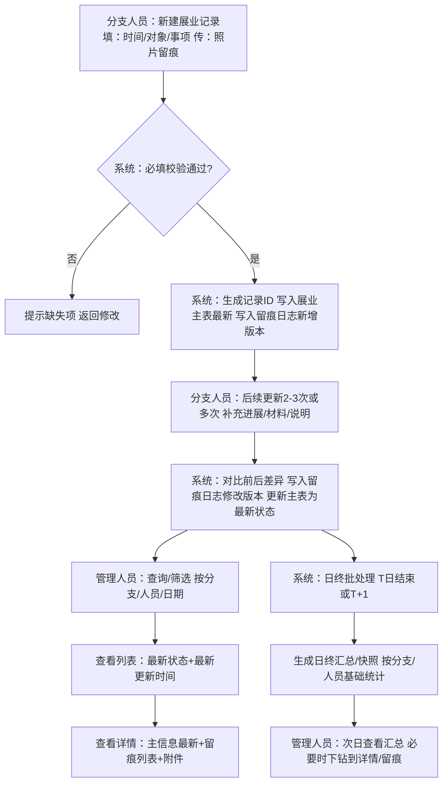
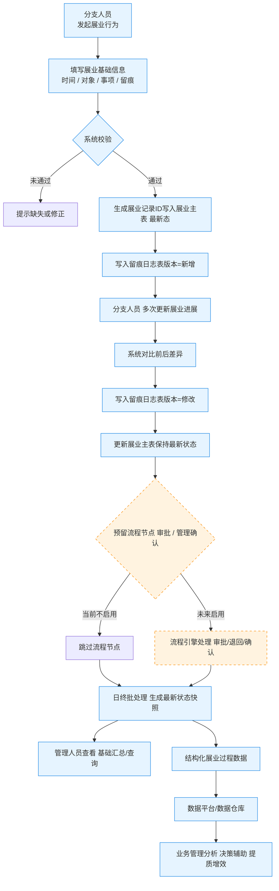

# 展业记录填报与留痕主流程

## 1）主流程（展业记录填报与留痕）

**泳道：分支人员 / 系统 / 管理人员（部门/总部）**

1. **分支人员：新建展业记录**
   - 进入“展业提报”
   - 选择/填写：展业日期、分支机构、人员、企业/对象、项目/事项说明
   - 上传：照片/附件（留痕材料）
   - 提交保存
2. **系统：校验与入库**
   - 必填校验：时间、对象、事项、留痕（按确认版需求的必填项）
   - 生成记录ID
   - 写入【展业主表】（当前最新信息）
   - 写入【留痕/变更日志表】（记录“新增”版本：时间、操作者、变更内容摘要）
3. **分支人员：后续更新（2–3次或多次）**
   - 打开已建记录
   - 修改：事项描述/阶段进展/补充材料/状态说明（若有状态字段则更新）
   - 保存提交
4. **系统：自动留痕**
   - 对比变更前后内容
   - 写入【留痕/变更日志表】（记录“修改”版本：变更字段、前值/后值、时间、操作者）
   - 更新【展业主表】为“最新状态”
5. **管理人员：查看当前进展**
   - 进入“展业查询/汇总”
   - 按分支/人员/日期筛选
   - 查看每条记录“最新状态 + 最新更新时间 + 关键留痕”

------

## 2）日终汇总流程（满足“当天动作，次日反映”）

1. **系统：日终批处理触发（T日结束或T+1凌晨）**
   - 读取当天新增/更新的展业记录（按更新时间）
   - 生成“日终快照/汇总表”（可选：若你们需要落库给报表）
2. **系统：汇总输出**
   - 按分支机构汇总：当日新增数、当日更新数、当前推进中的记录数等（仅基础汇总）
   - 按人员汇总：同上（仅基础汇总）
3. **管理人员：次日查看**
   - 在报表/汇总页面查看“截至昨日最新推进情况”
   - 需要追溯细节时点击进入记录详情 + 留痕日志

> 备注：这里的“日终”是业务口径，不等于秒级实时；与问卷一致。

------

## 3）查询与追溯流程（“查历史 + 不用人工解释”）

1. 管理人员/业务人员进入“展业查询”
2. 选择筛选条件：日期范围、分支、人员、企业/对象关键字
3. 系统返回列表（展示：对象、事项摘要、最新更新时间、最新状态/说明）
4. 点击某条记录进入详情：
   - 展业主信息（最新）
   - 留痕列表（按时间倒序）
5. 如需核对：下载/查看附件留痕

------

## 4）边界与异常处理（建议写进设计说明，防扯皮）

- **必填缺失**：系统提示缺失项，不允许提交
- **附件上传失败**：允许先保存草稿/或提示重试（你们看是否需要草稿；若不做草稿就提示重传）
- **记录修改权限**：默认“本人可改、可留痕”；若要跨人修改，走最简单的规则（比如同分支可改），不要上复杂权限
- **不纳入**：审批流、评分考核、CRM 实时联动（保持与确认版一致）

------

## 5）Mermaid 版流程图

